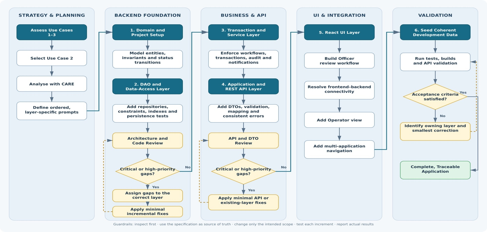

# Use Case Prioritisation: Delivering the Highest-Value Workflow Within Three Days

I made a deliberate decision to implement **Use Case 2** and defer Use Cases 1 and 3 based on 3 criteria in the order of highest business value, feasibility and complexity in this order.

My goal was to deliver one complete, production-oriented workflow rather than spread the available time across three partially implemented use cases.

This is also part of my Agile practice to deliver incremental artifacts at every sprint for the user to visualise the progress which greatly assist the sales team to and their sales presentations.

**Use Case 2**: Officer Application Review and Feedback** sits at the centre of the licensing process.

My primary motivation was to address a key operational bottleneck: simplify the complex interactions between officer and operator. By making the review and feedback workflow clearer, more structured and easier to manage, the system could streamline processes and increase the efficiency throughput which translates to dollar and cents in the real world.

The improved workflow also improves transaction traceability and the quality of feedback provided to operators. Each review decision, feedback item, status change and resubmission can be tracked consistently, creating a clearer audit trail and reducing ambiguity between both parties.

I have observed similar interaction patterns in the mission-critical government systems I have worked on. For example:

The eMobilisation system coordinated workflows between mobilisation administrators and mobilisation commanders.
The iBorders system supported operational interactions between ICA operators and ICA officers.

These experiences taught me that the efficiency of a system depends not only on its individual features, but also on how effectively it coordinates decisions, responsibilities and information across different user roles. This is why I prioritised Use Case 2: it addresses the operational handoffs that have the greatest influence on the efficiency, reliability and accountability of the overall licensing process.

To me, it is the use case with the highest business value.

## Why Use Case 1 and 3 are deferred

Use Case 1 was deferred because it seem simple but scope may be broader than it first appears. To guide the operator on entry is also a business value not as high as use case 2 because it involves 1 role. A typical production-quality operator submission workflow would require draft persistence, document uploads and asynchronous verification. A production-quality upload capability also introduces storage, file-size validation, malware scanning, MIME-type verification and access-control concerns. Delivering all of this properly in three days would be risky.

By deferring Use Case 1, the trade off is I did not build the complete application submission process for operators. I could have created a basic upload screen to make the system look more complete, but it would not have properly handled important requirements such as securely storing documents, validating uploaded files, saving drafts and preserving earlier submissions. I chose to focus on completing Use Case 2 properly instead of building a superficial version of Use Case 1.

Use Case 3 was deferred because it presented the greatest delivery uncertainty and contained several requirements that were not explicitly defined. For example, it was unclear whether officers would conduct on-site assessments using laptops, MacBooks, iPads or Android tablets such as Samsung devices.

Supporting multiple device types raises important technical and user-experience considerations, including responsive design, browser compatibility, network reliability, offline operation, autosaving, draft synchronisation, concurrent editing and conflict resolution.

The workflow also introduces a more complex data hierarchy involving site visits, checklists, individual checklist items, multiple clarification rounds, operator responses and supporting documents. These uncertainties would need to be clarified before selecting an appropriate architecture and implementing the workflow reliably.

By deferring Use Case 3, the trade off is I did not implement the on-site inspection workflow. Trying to build it within the same limited timeframe would have left less time to complete and properly test Use Case 2. Before implementing Use Case 3, I would also confirm whether officers need to continue working when there is no internet connection, as this requirement would significantly affect the system design.

## Here is what I will prioritise in this order

1. Use Case 2 — highest operational value and strongest fit within the available time
2. Use Case 1 — valuable next step for completing the operator-facing lifecycle
3. Use Case 3 — important, but dependent on further mobile and connectivity requirements

There were several broader trade-offs behind my decision:

| Decision                              | Benefit                                                    | Trade-off                                                                        |
| ------------------------------------- | ---------------------------------------------------------- | -------------------------------------------------------------------------------- |
| One complete vertical slice           | Demonstrates an end-to-end working outcome                 | Less overall feature coverage                                                    |
| Use Case 2 first                      | Addresses the platform’s operational centre                | Operator submission and site assessment remain incomplete                        |


One important limitation is that frontend-only validation and error translation improve the user experience but are not a complete enforcement mechanism. In a production system, the backend must remain the source of truth, return structured domain errors, and enforce the same rules regardless of which client calls the API.

In summary, I did not defer Use Cases 1 and 3 because of a value proposition. I deferred them because completing all three would have produced excessive breadth and insufficient depth. The decision reflects how I would approach a real mission-critical system: prioritise the highest-value workflow, protect data integrity, deliver it end to end, and document the remaining capabilities as deliberate next steps.

## Design patterns used in the project

This project uses a small set of practical design patterns that are appropriate for a mission-critical workflow system:

### 1. Layered architecture
The backend is structured in layers: web controllers, service layer, domain model and repository layer.

Why it is used:
- keeps responsibilities separate
- makes it easier to reason about HTTP concerns, business rules and persistence independently
- reduces coupling between UI/API logic and data logic
- allows the workflow to evolve without rewriting core business rules

This is visible in the split between `ApplicationsController`, `OfficerReviewService`, domain entities and repository interfaces.

### 2. Domain-driven design (DDD-lite)
The core business logic sits in the domain model rather than being spread across controllers or UI code.

Why it is used:
- status transitions and workflow rules are explicitly expressed in the domain
- it protects business invariants and prevents invalid application states
- it makes the workflow easier to audit and validate

Examples in the codebase include `Application`, `ApplicationStatus`, and `DomainRules`.

### 3. Repository pattern
Persistence logic is abstracted behind repository interfaces.

Why it is used:
- separates the domain from database concerns
- makes the service layer cleaner and easier to test
- allows the app to change persistence implementation without changing workflow logic

This pattern is used through repositories such as `ApplicationRepository` and `FeedbackItemRepository`.

### 4. DTO pattern
The backend exposes purpose-specific DTOs instead of exposing entities directly.

Why it is used:
- keeps the API contract stable and explicit
- prevents internal domain objects from being overexposed
- supports current UI needs without leaking persistence concerns

Examples include `ApplicationReviewDTO`, `RevisionDTO`, and `ApplicationListItemDTO`.

### 5. Service layer / orchestration pattern
Workflow behaviour is coordinated in service classes rather than in controllers.

Why it is used:
- controllers stay focused on HTTP concerns
- business workflow orchestration is centralized
- actions such as feedback creation, status changes, and notifications are coordinated consistently

`OfficerReviewService` is the main example of this pattern.

### 6. State machine pattern
Application status transitions are represented as an explicit state model.

Why it is used:
- the licensing workflow is rules-driven and status-dependent
- valid progression must be enforced, not guessed by the UI
- it improves traceability and prevents invalid workflow transitions

This is implemented via `ApplicationStatus` and `DomainRules.isAllowedTransition(...)`.

### 7. Event-style notification pattern
The system adds audit entries and notifications when important workflow events happen.

Why it is used:
- supports traceability and accountability
- makes operational visibility stronger for officers and operators
- supports a robust compliance and review trail

Examples include notifications sent when status changes or operator resubmission occurs.

### 8. Frontend composition and route-based view pattern
The React app is split into route-driven page components and reusable UI elements.

Why it is used:
- allows officer and operator workflows to remain separate while reusing shared data and logic
- makes the UI easier to maintain and extend
- clarifies role-specific responsibilities without duplicating all behaviour

This is visible in the `App.tsx` route selection and the `OfficerReview` / `OperatorReview` page components.

### 9. Dependency injection
Spring Boot uses dependency injection for services, repositories and other collaborators.

Why it is used:
- reduces tight coupling
- improves testability
- supports cleaner component wiring in a production-grade application

This pattern is central to the backend architecture.

Overall, the project uses a pragmatic combination of layered architecture, domain-driven rules, repository abstraction and workflow-driven state management. These patterns are appropriate because the system is not just a CRUD demo; it models a real operational workflow with status transitions, auditability, notifications and role-based decisions.

# AI Usage

## Purpose and Objective

AI was used as an engineering assistant to analyse, implement, review and validate **Use Case 2: Officer Application Review and Feedback**. The work was deliberately divided into small, ordered prompts so that each response had a clear responsibility, could be tested independently and built on verified work from the previous stage.

The objective was not to ask AI to generate the entire application in one pass. The approach was to:

1. Understand the business problem and rules.
2. Convert the use case into testable requirements.
3. Implement one architectural layer at a time.
4. Validate and review each architectural layer before proceeding.
5. Apply only the smallest necessary corrections.
6. Validate the completed vertical slice against its acceptance criteria.

## Overall prompt-engineering approach

The central instruction used throughout the prompts was:

> Treat the specification as the source of truth, constrain each AI task to a small scope, preserve previously working code, and require evidence and tests that every change works.

The following infographic summarises the development flow. Solid lines show forward delivery; dashed lines represent review and remediation loops.



The workflow applied five forms of control:

| Control | How it was applied | Intended benefit |
| --- | --- | --- |
| Business-first analysis | Use Case 2 was analysed with the CARE framework before implementation | Aligns the solution with users, outcomes and business rules |
| Ordered decomposition | Separate prompts were created for the domain, DAO, service, API, UI, seed data and integration stages | Reduces context mixing and uncontrolled changes |
| Repository inspection | Every implementation prompt instructed the agent to inspect the existing repository first | Keeps new work consistent with the actual codebase |
| Scope boundaries | Each prompt named the permitted layer and prohibited unrelated changes | Protects working behaviour and limits unnecessary refactoring |
| Evidence-based validation | Prompts required tests, builds, commands executed and actual results | Makes completion claims observable and verifiable |

## 1. Business analysis with CARE

The initial prompt used the **CARE** framework to transform the use-case specification into engineering work:

- **Context:** users, operational problem and desired outcome.
- **Actions:** capabilities and workflow steps to implement.
- **Requirements and Constraints:** business rules, technical limits and assumptions.
- **Expected Output:** deliverables and acceptance criteria.

Refer to [PROMPTS.md](./PROMPTS.md) for the full prompt text.

```text
Analyse Use Case 2 using the CARE framework:

* Context: Understand the problem, users and desired outcome.
* Actions: Identify the tasks and features to implement.
* Requirements and Constraints: Extract the business rules,
  technical requirements, limitations and assumptions.
* Expected Output: Define the required deliverables and
  acceptance criteria.
```

The same prompt asked AI to produce an ordered set of agent-mode prompts rather than application code. This separated planning from execution and created a controlled implementation sequence.

## 2. Layer-by-layer implementation

The application was built progressively, with each layer depending on the verified output of the preceding layer.

| Stage | Primary concern | Examples of robustness introduced |
| --- | --- | --- |
| Domain and project setup | Represent business concepts and invariants | Controlled status transitions, immutable revisions, contextual feedback and optimistic locking |
| DAO and data access | Persist the model correctly | Uniqueness, foreign-key relationships, indexes, ordered queries and persistence tests |
| Transaction and service | Coordinate complete business operations | Atomic status, audit and notification changes; rollback and conflict handling |
| Application and REST API | Provide stable external contracts | DTO isolation, request validation, consistent errors and appropriate HTTP semantics |
| React UI | Deliver the Officer workflow | Typed API integration, accessibility and explicit loading, empty, success and failure states |
| UI refinements | Complete the user journey | Operator view, frontend-backend connectivity and multi-application navigation |
| Seed data and integration | Support repeatable end-to-end testing | Stable UUIDs, coherent relationships, realistic test data and API verification |

### Example: domain-layer prompt

The domain prompt defined both the required work and explicit exclusions:

```text
Inspect the existing repository before making any changes. Identify the
existing files, build tools, frameworks and coding conventions. Preserve
all existing work and do not change unrelated code.

Create only the project foundation and domain model.

Requirements:
* An Application has a unique reference number.
* Add an optimistic-lock version field to Application.
* Revision numbers must be sequential within an application.
* Earlier revisions must not be modified when a new revision is created.
* Feedback must identify whether it targets a form field or document.
* Define which MVP status transitions are allowed.

Do not implement repository, service, controller or UI code yet.
```

This prompt established the core business vocabulary and kept domain rules out of controllers and screens.

### Example: transaction and service-layer prompt

The service prompt described business operations as atomic transactions:

```text
Requesting resubmission requires at least one open feedback item.
Requesting resubmission changes the status to
PENDING_PRE_SITE_RESUBMISSION.
The status change, audit entry and Operator notification must be saved
in one transaction.

Recording a resubmission creates a new revision instead of modifying
the previous revision.
Every important state-changing action must create an audit entry.
Optimistic-lock conflicts must not be silently ignored.
```

These instructions made transaction boundaries, auditability and concurrency behaviour explicit instead of leaving them for AI to infer.

### Example: REST API prompt

The API prompt introduced a boundary between persistence entities and external clients:

```text
Create simple request and response DTOs, manual mapper methods,
REST controllers and a global exception handler.

Do not expose JPA entities directly.

* Validate required fields and comment length.
* Return 404 when an application or feedback item is not found.
* Return 409 for invalid status transitions and optimistic-lock conflicts.
* Use one consistent JSON error structure.
```

This kept the API contract stable and prevented persistence concerns from leaking into the frontend.

### Example: React UI prompt

The frontend prompt required the UI to use the backend contract without duplicating authoritative business rules:

```text
Keep REST calls in the API client rather than individual presentational
components.
Do not duplicate authoritative backend status-transition logic.
Show a useful message for validation, not-found, conflict and server errors.
For a conflict, tell the Officer that the application changed and should
be refreshed.
Configure the API base URL through a Vite environment variable.
```

Later CARE-based prompts addressed narrowly defined gaps, including the Operator view and navigation between multiple applications, while preserving the existing Officer workflow.

## 3. Review and remediation gates

AI was also used as a reviewer. Review prompts were intentionally separated from implementation prompts so that findings could be assessed before code was changed.

A representative review instruction was:

```text
Provide a focused code and design review covering:

* Whether the implementation correctly and completely satisfies the use case
* Missing, misunderstood, or incorrectly implemented requirements
* Domain-model and data-access design issues
* Data integrity, validation, transaction, concurrency, security,
  and error-handling concerns
* Unnecessary complexity, duplication, or premature abstractions
* Test coverage gaps and important edge cases

Prioritise findings by severity: Critical, High, Medium, and Low.
Do not modify any files or generate code.
```

Findings were then assigned to the architectural layer that owned the concern. Only critical or high-priority gaps that needed attention at the current stage were corrected before work continued. Remediation prompts requested minimal, incremental changes instead of broad rewrites.

This produced two main feedback loops:

1. **Architecture and code review** after the domain and DAO foundation.
2. **API and DTO review** after the service and REST API layers.

The final validation loop identified the owning layer of any failed acceptance criterion and requested the smallest correction before tests were rerun.

## 4. Continuous validation

Every implementation prompt requested relevant positive, negative and edge-case tests. The expected completion report consistently included:

- Repository structure or existing layers inspected.
- Assumptions made.
- Files created or modified.
- Functionality implemented.
- Tests added.
- Commands executed and their actual results.
- Known limitations or deferred work.

Validation was tailored to each layer:

| Layer | Representative validation |
| --- | --- |
| Domain | Allowed and rejected status transitions, status labels and domain validation |
| DAO | Constraints, ordered queries, open-feedback lookup and optimistic locking |
| Service | Rollback, audit and notification creation, immutable revisions and repeated workflow rounds |
| API | MockMvc tests for validation, `404`, `409`, comparison, feedback and history endpoints |
| UI | Component tests, type checking, accessibility behaviours and production build |
| Integration | Backend clean build, all tests, frontend build and local API smoke test where possible |

The final integration prompt required AI to verify the complete vertical slice without adding new product features:

```text
Integrate and verify the complete Use Case 2 vertical slice.

Do not add new product features and do not refactor unrelated code.

Run:
* Backend clean build
* All backend tests
* Frontend type checking
* All frontend tests
* Frontend production build
* A local API smoke test if the environment permits it

Fix only failures related to the implemented scope.
```

## 5. Guardrails used across the prompts

The following instructions were repeated because they materially influenced AI output:

- Inspect the repository before making changes.
- Build on the output of the previous prompt.
- Change only the specified layer or narrowly defined problem.
- Preserve existing conventions and working behaviour.
- Avoid unnecessary frameworks, abstractions and dependencies.
- Add focused tests and run them.
- Report commands and actual results rather than claiming success without evidence.
- State assumptions, limitations and deferred work.

The prompts also constrained technology choices. For example, the frontend prompt permitted React, TypeScript, Vite, native `fetch`, Vitest and plain CSS, while explicitly excluding Redux, Axios, Tailwind and large component libraries. Similar exclusions kept the backend appropriate for a three-day assessment.

## 6. Human oversight and accountability

AI proposed implementation details and design patterns, but the development process remained human-directed. Human judgement determined:

- The selection of Use Case 2 based on business value, feasibility and complexity.
- The order and scope of each prompt.
- Which AI recommendations were appropriate for the three-day delivery constraint.
- Which review findings were important enough to address immediately.
- Whether a correction belonged in the current layer or a later layer.
- Whether test evidence and application behaviour satisfied the acceptance criteria.

This distinction is important: AI accelerated analysis, code generation and review, while responsibility for requirements, trade-offs, verification and final acceptance remained with the engineer.

## 7. Resulting development pattern

The overall pattern can be summarised as:

```text
Understand -> Constrain -> Implement -> Test -> Review -> Correct -> Integrate
```

The main strength of this prompt-engineering approach was not prompt length but the deliberate control of AI behaviour: **inspect first, implement narrowly, verify objectively, disclose assumptions and correct only what the evidence shows is necessary**.

# What I should do next

I would not describe the resulting assessment application as production-ready. There are still workflows that are partially implemented, and the current architecture is not yet hardened for production.

Before production, 
1) I would implement the following which provides an incremental path to production without discarding the assessment solution or prematurely introducing distributed-system complexity. 
   1.1) Migrate to PostgreSQL and Flyway
   1.2) Strengthen security and audit controls
   1.3) Validate concurrency and immutable revision handling
   1.4) Implement durable document storage and activate reliable notification-outbox processing. 
   1.5) Real integrations, asynchronous messaging, 
   1.6) Kubernetes or microservices would be introduced only when operational requirements justify them.
2) Fully implement partially implemented workflows of Use Case 2
3) Fully implement Use Case 1 followed by Use Case 3 in this order, with careful attention to mobile and offline requirements.